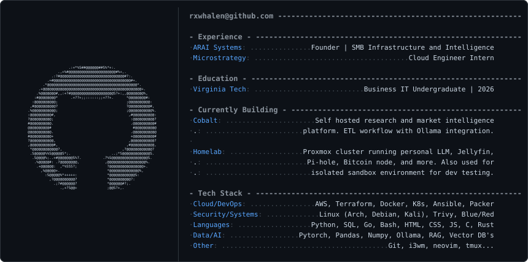

### Certifications
 ·
 ·
 ·
[-623CE4?logo=terraform&logoColor=white)](https://www.credly.com/badges/d64ce3e0-a330-4ba0-a38a-dafd93386a35/linked_in_profile) ·
 ·

---

### About me
Hi there! I'm Ruari, a Business IT student at Virginia Tech. I'm currently building a career to sit at the intersection between cloud architecture, cybersecurity, and business. Outside of school, I currently run a small freelance cloud practice - ARAI Solutions, where I help SMB clients optimize their digital infrastructure. Additionally, I run my own homelab for security, research, and entertainment. Feel free to contact me with any inquiries!
